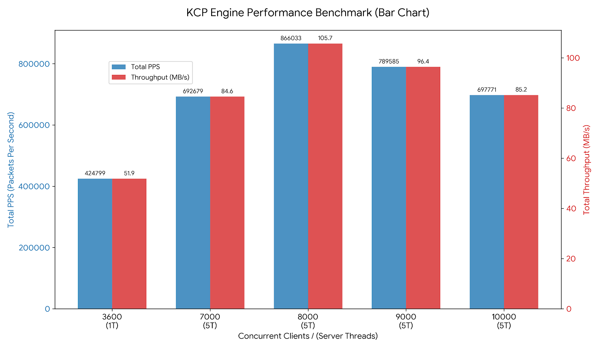

This project incorporates or references third-party KCP code (ikcp, kcp-csharp). See `THIRD_PARTY_NOTICES` for details.

# akcp

[中文版](./README_zh.md) | [English](./README.md)

---

A lightweight wrapper library based on Boost.Asio and KCP. It provides business-oriented `server/client/channel` interfaces, supporting connection management, message transceiving, timeout recovery, and built-in stress test examples.

C# protocol interfaces are provided for seamless communication between C++ and C# versions.

## Features

- **Encapsulated KCP Lifecycle**: Manages creation, sending/receiving, updating, and releasing of KCP sessions.
- **Event-Loop Based**: UDP I/O and callback dispatching based on Boost.Asio event loops.
- **Server/Client APIs**: High-level abstractions via `kcp::server` and `kcp::client`.
- **Built-in Demos**: Includes single-connection demos and stress test projects for rapid verification.
- **Customizable Memory**: Provides interfaces for setting custom buffer pools.
- **Linux Optimizations**: 
  - Supports batch I/O (sendmmsg/recvmmsg) for high-throughput scenarios.
  - Supports CPU affinity (core pinning) for minimized context switching.

## Directory Structure

- `resource/`: Core library implementation (server, client, channel, context, timer).
- `test/`: Examples and benchmarks (single_demo, multi_thread, stress_test).

## Installation

Requirements:
- CMake >= 3.10
- C++11 Compatible Compiler
- Boost.Asio (Boost Library)
- jsoncpp (Required only for `client_stress`)

### Linux
```bash
mkdir build; cd build
cmake -S .. -B . -DAKCP_BUILD_TESTS=OFF -DCMAKE_INSTALL_PREFIX=${/path/to/dir}
make; sudo make install
```

### Windows
```bash
mkdir build; cd build
cmake -S .. -B . -DCMAKE_TOOLCHAIN_FILE=${vcpkg-install-dir}/scripts/buildsystems/vcpkg.cmake -DVCPKG_TARGET_TRIPLET=x64-windows -DAKCP_BUILD_TESTS=OFF -DCMAKE_INSTALL_PREFIX=${/path/to/dir}

cmake --build . --config Release
cmake --install . --config Release
```

## Quick Start

Usage after installation:
```cmake
# CMakeLists.txt
cmake_minimum_required(VERSION 3.10)
set(CMAKE_EXPORT_COMPILE_COMMANDS ON)
project(demo_use_akcp)

set(CMAKE_CXX_STANDARD 17)
set(CMAKE_CXX_STANDARD_REQUIRED ON)

find_package(akcp CONFIG REQUIRED)

add_executable(server main.cc)
target_link_libraries(server PRIVATE akcp::akcp)
```

## Testing

Build:
```bash
mkdir build; cd build
cmake -S .. -B .
make
```

### Single Connection Demo
```bash
# Terminal 1
./build/test/single_demo/server

# Terminal 2
./build/test/single_demo/client
```

### Stress Test
```bash
# Terminal 1
./build/test/stress_test/server_stress 8080

# Terminal 2
./build/test/stress_test/client_stress 127.0.0.1 8080 100 30 60 128
```

Parameter Meanings:
`ip port clients duration_seconds req_per_client_per_sec packet_size`

### Benchmark Results

Testing Environment:
- **Hardware**: 12 Cores / 16 GB RAM
- **OS**: Ubuntu 22.04 LTS
- **Network**: Single-machine local test (to eliminate bandwidth bottlenecks)

#### 1. Single-Thread Server Performance
Both client and server utilize CPU affinity (1 Server thread, 6 Client threads).

**Test Command:**
```bash
# server
./server_stress 8080
# client
./client_stress 127.0.0.1 8080 3600 20 60 128
```
- Clients: 3600
- Request Rate: 60 msg/s per client
- Packet Size: 128 Bytes
- Duration: 20s

When reaching 3,600 clients, the single server thread CPU usage reached **98%**.

**Data:**
```json
{
    "1.settings" : 
    {
        "client number(preset)" : 3600,
        "client number(success)" : 3600,
        "package size" : 128,
        "request rate(/s)" : 60,
        "test time" : 20,
        "total speed" : 216000
    },
    "2.client result" : 
    {
        "bps" : 
        {
            "server rx(b/s)" : 27187142,
            "server tx(b/s)" : 27187142,
            "total(/s)" : 54374284
        },
        "loss" : 0,
        "pps" : 
        {
            "server rx(/s)" : 212399,
            "server tx(/s)" : 212399,
            "total(/s)" : 424799
        }
    }
}
```

#### 2. Multi-Thread Server Performance
Core pinning: 5 Server threads, 7 Client threads.

**Test Command:**
```bash
# server
./server_stress 8080
# client
./client_stress 127.0.0.1 8080 7000 20 60 128
```
Based on testing, the logic for handling ~1,200 clients saturates a single core (~95% CPU).

- Clients: 7,000+
- Request Rate: 60 msg/s per client
- Packet Size: 128 Bytes
- Duration: 20s

**Performance Metrics:**
- Client threads CPU usage: Avg 98%
- Server threads CPU usage: Avg 98%

Detailed data can be found in the [Results File](test/result/result.json).



**Notes:**
- The test server only performs an echo of the data sent by clients.
- All statistics reflect **application-layer data**; KCP handshakes, heartbeats, and ACKs are excluded from these counts.

**Summary Table:**

| Client Count | Throughput (MB/s) | PPS (k/s) |
|:---------:|:---:|:---:|
| 7,000 | 105 | 821 |
| 8,000 | 110 | **866** |
| 9,000 | 101 | 789 |
| 10,000 | 89 | 697 |

## Socket Buffer Tuning

The project configures UDP receive/send buffers in the code (see `common/common.hh` and `resource/io_socket.cc`). Under high-load scenarios, it is highly recommended to adjust the OS system limits to prevent burst packet loss.

**Linux Example:**
```bash
sudo sysctl -w net.core.rmem_max=134217728
sudo sysctl -w net.core.rmem_default=134217728
sudo sysctl -w net.core.wmem_max=134217728
sudo sysctl -w net.core.wmem_default=134217728
sudo sysctl -w net.core.netdev_max_backlog=10000
```