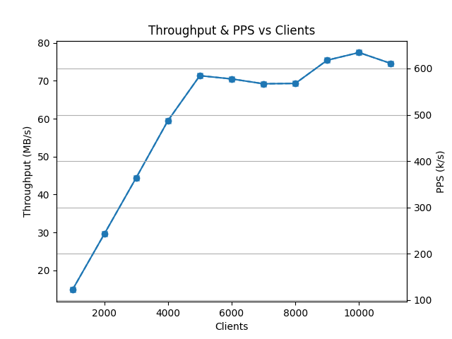
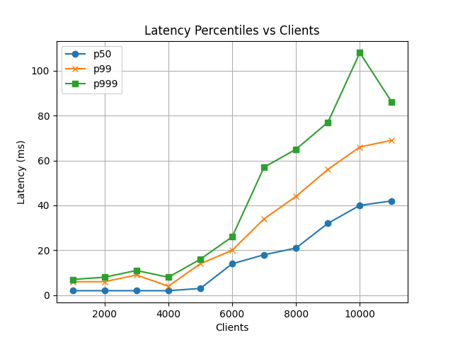
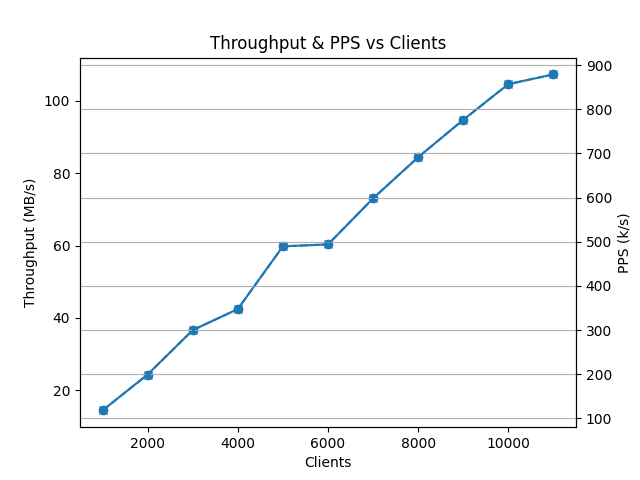
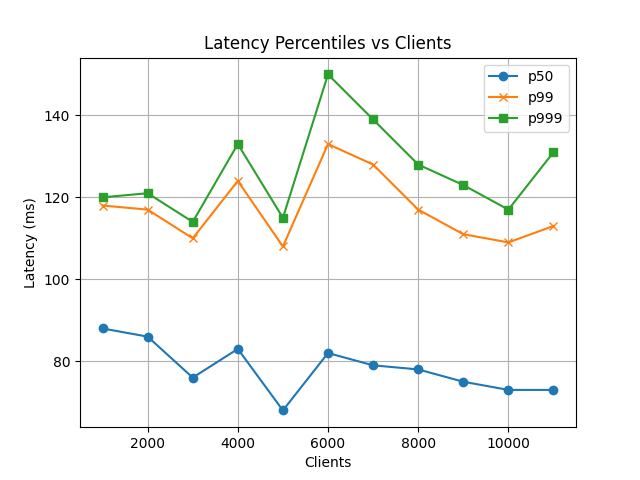
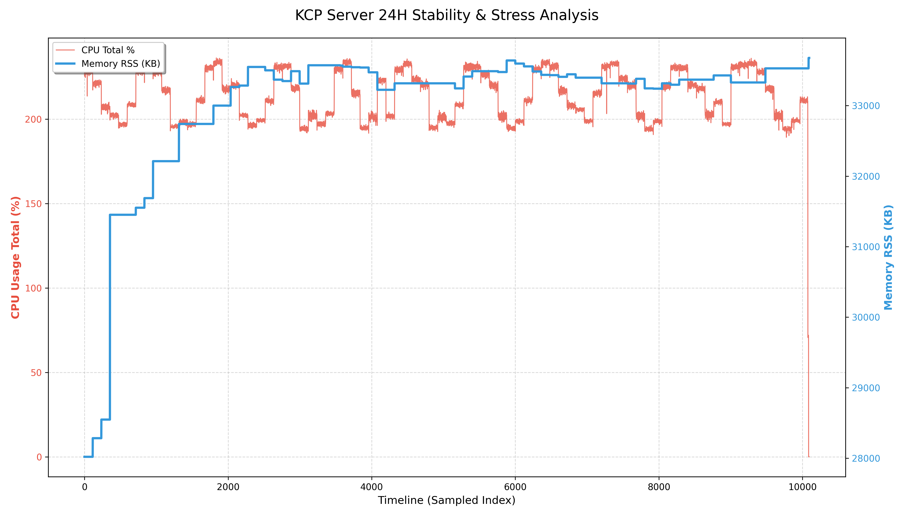

本项目包含或者借鉴第三方 KCP (ikcp, kcp-csharp) 代码，详见 THIRD_PARTY_NOTICES。

# akcp

[中文版](./README_zh.md) | [English](./README.md)

---

基于 Boost.Asio + KCP 的轻量封装库，提供面向业务的 `server/client/channel` 接口，支持连接管理、消息收发、超时回收与基础压测示例。

提供了CSharp的协议接口,可以和C++版本正常通信

## 功能概览

- 封装 KCP 会话生命周期（创建、收发、更新、释放）
- 基于事件驱动的 UDP 收发与回调分发
- 提供服务端/客户端 API：`kcp::server`、`kcp::client`
- 默认是 kcp 的低延迟版本, 如果不需要低延迟,提供了接口可手动关闭低延迟模式已获取更高的 pps 和 bps
- 内置 demo 与测试代码，便于快速验证
- 提供了 自定义 buffer pool 的设置接口
- 内部对 linux 环境下的输入输出进行了批量发送优化
- 内部对 linux 环境下的绑核操作进行了支持

## 目录结构

- `resource/`：核心库实现（server/client/channel/context/timer）
- `test/`：示例与测试（single_demo、multi_thread、stress_test）

## 编译安装

要求：

- CMake >= 3.10
- C++11 编译器
- Boost.Asio（Boost）
- jsoncpp（仅 `client_stress` 需要）

linux

```bash
mkdir build; cd build
cmake -S .. -B . -DAKCP_BUILD_TESTS=OFF -DCMAKE_INSTALL_PREFIX=${/path/to/dir}
make; sudo make install
```

windows

```bash
mkdir build; cd build
cmake -S .. -B . -DCMAKE_TOOLCHAIN_FILE=${vcpkg-install-dir}/scripts/buildsystems/vcpkg.cmake -DVCPKG_TARGET_TRIPLET=x64-windows -DAKCP_BUILD_TESTS=OFF -DCMAKE_INSTALL_PREFIX=${/path/to/dir}

cmake --build . --config Release
cmake --install . --config Release
```

## 快速运行

安装之后使用
```cmake
# CMakeLists.txt
cmake_minimum_required(VERSION 3.10)
set(CMAKE_EXPORT_COMPILE_COMMANDS ON)
project(demo_use_akcp)

set(CMAKE_CXX_STANDARD 17)
set(CMAKE_CXX_STANDARD_REQUIRED ON)

find_package(akcp CONFIG REQUIRED)

add_executable(server main.cc)
target_link_libraries(server PRIVATE akcp::akcp)
```

## 测试

编译
```bash
mkdir build; cd build
cmake -S .. -B .
```

### 单连接示例

```bash
# 终端1
./build/test/single_demo/server

# 终端2
./build/test/single_demo/client
```

### 测试说明

在项目的 test 目录中, 有我在做项目的时候写的[简单 demo](test/single_demo/), 和[多线程服务器分流测试](test/multi_thread/)的代码,以及 [压力测试](test/stress_test/),[pps bps 和 p99数据测试](test/pps_bps_p99/), [14 小时4000 客户端的稳定性测试](test/balance/)

其中值得注意的是, 在 `pps` 的测试和`稳定性` 测试中,你可以通过关闭服务器程序和客户端程序的低延迟模式,让 kcp 进行合包处理, 那样可以有更高的 pps 和 bps,但是随之而来的是你的延迟会降低到你设定的 `interval`(也就是`kcp`内部驱动时间间隔)左右,  

### 测试数据示例:

测试数据和系统环境有关系, 如果你测试的数据和我展示的数据有差异,请考虑机器配置和网络环境,一切以实际测试为准

测试环境:

- 机器配置: 12 核心 16 GB 内存
- 操作系统: ubuntu 22.04 STL
- 单机测试( 为了忽略网络带宽的影响 )

客户端和服务端都进行和绑核操作(5 个服务端线程, 7 个客户端线程)

测试数据如下:

#### 低延迟测试数据

从 1000 客户端到 11000 客户端的数据展示

测试命令:
```bash
# server
./server_pbp 8080
#client
./client_pbp 127.0.0.1 8080
```

`bps` 和 `pps`



`p50` `p99` `p999`




#### 关闭低延迟模式


测试命令:
```bash
# server
./server_pbp 8080
#client
./client_pbp 127.0.0.1 8080
```


`bps` 和 `pps`



`p50` `p99` `p999`




数据说明:

- 测试服务器中,只对客户端发送的数据进行回显.
- 其中, 所有的数据均是应用层数据, 未统计 kcp 前置握手和 kcp 层的数据包.

#### 稳定性测试

让服务器打开低延迟模式运行了 14 小时, 期间用 3000 个连接长时间连接进行访问, 还有 1000 个连接请求 10 分钟之后,断开连接,重新在发起 1000 个连接, 一直保持 14 个小时,

用 pidstat 进行服务器进程的资源监视, 如图所示




所有的测试数据均在 `test/result` 下


## Socket 缓冲区说明

项目已在代码里设置 UDP 收发缓冲区（见 `common/common.hh` 与 `resource/io_socket.cc`）。
高压场景下建议同步调整系统上限，否则可能出现突发丢包。

Linux 示例：

```bash
sudo sysctl -w net.core.rmem_max=134217728
sudo sysctl -w net.core.rmem_default=134217728
sudo sysctl -w net.core.wmem_max=134217728
sudo sysctl -w net.core.wmem_default=134217728
sudo sysctl -w  net.core.netdev_max_backlog=10000
```
